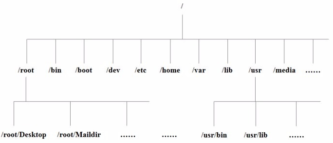

### 1.Linux下的目录结构
1. Linux系统的目录结构

- /bin: binary, 二进制文件, 可执行程序, shell命令等; 如: ls, rm, mv, cp等常用命令;
- /sbin: s是Super User的意思，存放系统管理员使用的系统管理程序，如：ifconfig, halt, shutdown, reboot等系统命令;
- /dev: device, 在Linux下一切皆文件，如硬盘, 显卡，显示器；字符设备文件，块设备文件(例如：在input目录下执行`sudo cat mouse0`, 移动鼠标会显示有输入);
- /lib: Linux运行时需要加载的一些动态库，如: `libc.so, libpthread.so`等;
- /mnt: 手动挂载的目录，如U盘等；
- /media: 外设的自动挂载目录，如光驱等;
- /root: Linux超级用户root的家目录;
- /usr: unix system resource 类似于Windows中的program files目录
    - include目录中存放的头文件，如: stdio.h, stdlib.h, string.h, pthread.h;
    - games目录中存放的小游戏, 如: sl 小火车游戏
- /etc: 存放配置文件，
    - /etc/passwd: `man 5 passwd` 可以查看passwd文件的格式信息；
    - /etc/group: `man 5 group` 可以查看group文件的格式信息；
    - /etc/profile: 系统的配置文件，修改该文件会影响系统下的所有用户；
- /opt: 安装第三方应用程序， 如安装数据库便可以安装在该目录下；
- /home: Linux系统所有用户的家目录
- /tmp: 存放临时文件， 新建在该目录下的文件会在系统重启后自动清除；

2. 绝对路径与相对路径
- 绝对路径：从根目录开始表示的路径，即从 /(斜杠) 开始, 如：`/home/user`;
- 相对路径：从当前所处的目录开始表示的路径
    - . 表示当前目录;
    - .. 表示当前目录的上一级目录;

3. Linux中的命令提示符
- `~$`: 表示当前用户为普通用户;
- `~#`: 表示当前用户为root用户;

### 2. 文件和目录操作相关命令
1. tree命令
- 以树状形式查看指定目录内容，使用该命令需要安装软件tree
    ```./bash
        sudo apt-get update
        sudo apt-get install tree
    ```
- 使用方法：
    ```
        tree # 树形结构显示当前目录下的文件信息
        tree 目录   # 树形结构显示指定目录下的文件信息
        如：tree /home/
    ```
使用tree命令查看目录内容层次清晰，tree命令只能查看目录内容，不能查看普通文件内容；

2. ls命令
- 查看指定目录下的文件信息
- 使用方法：
    ```
    ls  # 显示当前目录下的文件信息
    ls  目录    # 显示指定目录下的文件信息
    ```
- 相关参数
    - -a: 列出当前目录下的所有文件，包括：
    