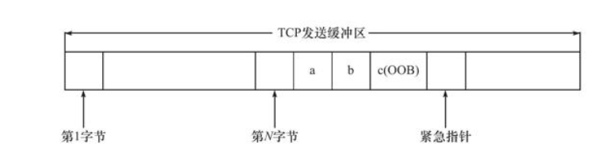
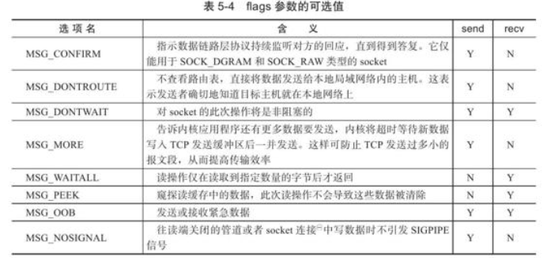

### 1. 什么是带外数据
在某些传输层系统中具有带外(Out of Band)数据的概念，其是用来迅速告知对方本端发生的重要事件。因此，带外数据要比普通数据(或称为带内数据)具有更高的优先级，它应该被立即发送，而不论发送缓冲区中是否有排队等候发送的普通数据。

带外数据的传输既可以使用一条独立的传输层连接，也可以映射到普通数据的连接中。实际应用中，带外数据的使用比较少见，已知的仅有telnet、ftp等远程非活跃程序。

UDP中并没有实现带外数据传输，而TCP也没有真正的带外数据，但TCP中利用其头部中的紧急指针标志和紧急指针两个字段，为应用程序提供了一种紧急方式。该方式利用传输普通数据的连接来传输紧急数据，这种紧急数据的含义和带外数据类似，因此也将TCP紧急数据称为带外数据。

### 2. TCP发送带外数据的过程

如图，假设TCP的发送缓冲区中已经写入了N字节的普通数据，并等等发送，在数据被发送前，又向该连接写入了3字节的带外数据"abc", 此时，待发送的TCP报文段头部将被设置URG标志，并且紧急指针被设置为指向最后一个带外数据的下一个字节（进一步减去当前TCP报文段的序号值得到其头部中的紧急偏移值）。

由图中可见，发送端一次发送的多字节的带外数据中，只有最后一个字节被当作是带外数据，即字母c；而其他数据（字母a和b）则被当成了普通数据。若TCP模块以多个TCP报文段来发送缓冲区中的内容，则美国TCP报文段都将被设置URG标志，且它们的紧急指针将指向同一个位置，即数据流中带外数据的写一个位置），但实际只有一个TCP报文段是真正携带带外数据。

在TCP接收端，只有在接收到紧急指针标志时才会坚持紧急指针，并根据紧急指针所指的位置确定带外数据的位置，并将其读入到一个特殊的缓冲区中。其中，该缓冲区只有1字节，称为带外缓存。如果上传应用没有及时将带外数据从该缓存中读取，则后续的带外数据将覆盖它。

上述为TCP模块接收带外数据的默认方式。实际上，如果给TCP连接设置了SO_OOBINLINE选项，则带外数据将和普通数据一样，被存放在TCP接收缓冲区中，此时，应用程序需要向读取普通数据一样来读取带外数据，然后对其进行区分。

### 3. TCP实现带外数据的发送和接收
用于TCP数据读写的系统调用为：
```c
#include <sys/types.h>
#include <sys/socket.h>

ssize_t recv(int sockfd, void* buf, size_t len, int flags);

ssize_t send(int sockfd, const void* buf, size_t len, int flags);
```
其中flags参数为数据收发提供了额外的控制，其可以取如下表格中的一个或多个的逻辑或。

表中MSG_OOB选项就给应用程序提供了发送和接收带外数据的方法。
- 发送带外数据
```c
#include <sys/socket.h>
#include <netinet/in.h>
#include <arpa/inet.h>
#include <assert.h>
#include <stdio.h>
#include <unistd.h>
#include <string.h>
#include <stdlib.h>

int main(int argc, char* argv[])
{
    if (argc <= 2)
    {
        printf("Usage: %s ip_address, port_number\n", basename(argv[0]));
        return 1;
    }

    const char* ip = argv[1];
    int port = atoi(argv[2]);

    struct sockaddr_in server_address;
    bzero(&server_address, sizeof(server_address));
    server_address.sin_family = AF_INET;
    inet_pton(AF_INET, ip, &server_address.sin_addr);
    server_address.sin_port = htons(port);

    int sockfd = socket(PF_INET, SOCK_STREAM, 0);
    assert(sockfd >= 0);

    if(connect(sockfd, (struct sockaddr*)&server_address, sizeof(server_address)) < 0)
    {
        printf("connection failed\n");
    }
    else
    {
        const char* oob_data = "abc";
        const char* normal_data = "123";

        send(sockfd, normal_data, strlen(normal_data), 0);
        send(sockfd, oob_data, strlen(oob_data), MSG_OOB);
        send(sockfd, normal_data, strlen(normal_data), 0);
    }

    close(sockfd);

    return 0;
}
```

- 接收带外数据
```c
#include <sys/socket.h>
#include <netinet/in.h>
#include <arpa/inet.h>
#include <assert.h>
#include <stdio.h>
#include <unistd.h>
#include <stdlib.h>
#include <errno.h>
#include <string.h>

#define BUF_SIZE 1024

int main(int argc, char* argv[])
{
    if (argc <= 2)
    {
        printf("Usage: %s ip_address, port_number\n", basename(argv[0]));
        return 1;
    }

    const char* ip = argv[1];
    int port = atoi(argv[2]);

    struct sockaddr_in address;
    bzero(&address, sizeof(address));
    address.sin_family = AF_INET;
    inet_pton(AF_INET, ip, &address.sin_addr);
    address.sin_port = htons(port);

    int sockfd = socket(PF_INET, SOCK_STREAM, 0);
    assert(sockfd >= 0);

    int ret = bind(sockfd, (struct sockaddr*)&address, sizeof(address));
    assert(ret != -1);

    ret = listen(sockfd, 5);
    assert(ret != -1);
    struct sockaddr_in client;
    socklen_t client_addrlen = sizeof(client);
    int connfd = accept(sockfd, (struct sockaddr*)&client, &client_addrlen);

    if(connfd < 0)
    {
        printf("errno is: %d\n", errno);
    }
    else
    {
        char buffer[BUF_SIZE];
        memset(buffer, '\0', BUF_SIZE);
        ret = recv(connfd, buffer, BUF_SIZE-1, 0);
        printf("got %d bytes of normal data '%s' \n", ret, buffer);

        memset(buffer, '\0', BUF_SIZE);
        ret = recv(connfd, buffer, BUF_SIZE-1, MSG_OOB);
        printf("got %d bytes of oob data '%s' \n", ret, buffer);

        memset(buffer, '\0', BUF_SIZE);
        ret = recv(connfd, buffer, BUF_SIZE-1, 0);
        printf("got %d bytes of normal data '%s' \n", ret, buffer);

        close(connfd);
    }

    close(sockfd);
    return 0;
}
```

- 首先运行接收端程序`./recv.exe ip port`, 例如：`./recv.exe 192.168.23.132 54321`;
- 然后运行发送端程序`./send.exe ip port`, 例如：`./send.exe 192.168.23.132 54321`;

### Reference
[1] Linux高性能服务器编程 游双著.

